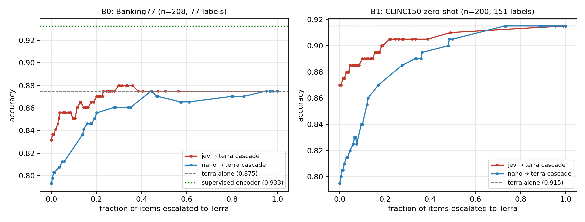

# Jev vs. the right baselines: a pre-registered independent evaluation

Independent evaluation of [TypeSafe's Jev](https://www.typesafe.ai/) (System One typed-decision model) on
**intent classification and confidence-gated cascades**, run on 2026-09-18, two days after Jev's public launch.

Not affiliated with TypeSafe. No vendor involvement, no free credits; API costs (~$1 total) paid by the author.

> **Erratum 2026-09-18 (same day, two rounds):** the first published version overstated several results, and
> my first round of corrections introduced a new error of its own. Two rounds of external review (GPT-6 Astra
> via the Codex CLI; prompts and outputs in `reviews/`) found problems that I verified and corrected — the
> calibration language, B0's escalation numbers, an encoder-vs-frontier arithmetic error, the missing cross-fit
> accuracies, the missing threshold-margin sensitivity that **flips the sign of the headline cascade result**,
> and then a wrong explanation of *why* it flips. See [Erratum](#erratum) for both rounds.

## Summary

Both experiments were pre-registered with kill/go criteria. **Both returned AMBIGUOUS.** Nothing here
establishes that Jev is a better escalation gate than a small LLM. What the data does support, for these two
samples and configurations:

- Jev is a **strong zero-shot classifier**: +7.5pp over `gpt-5.4-nano` on CLINC150 (paired 95% CI [+3.0, +12.5]),
  −4.5pp vs frontier `GPT-5.6 Terra` (CI [+2.0, +7.5] in Terra's favor).
- Jev's **per-call latency is ~2.2x lower than a nano-class LLM** run serially on the same 30 items (median
  0.42s vs 0.92s) — not the 40–200x the vendor's own comparisons suggest. Throughput is a separate story, and
  under rate limiting it is much worse than per-call latency (see [Latency](#latency-how-it-was-measured-and-what-biases-remain)).
- **Where labeled data exists, a 9ms supervised encoder wins**: +5.8pp over the frontier model on Banking77
  (paired CI [+2.4, +9.6]), at no per-call cost, on a laptop.
- Jev's confidence **did not rank its own errors better** than an LLM's verbalized confidence on CLINC150
  (AUROC 0.734 vs 0.816; paired diff CI [−0.187, +0.008], includes zero). The opposite ordering appeared on
  Banking77. Neither direction is established.

## Why another Jev eval

Several independent evals appeared within 48h of launch
([4esv/jev-eval](https://github.com/4esv/jev-eval), [themsquared/jev-benchmark](https://github.com/themsquared/jev-benchmark),
[classmethod](https://dev.classmethod.jp/en/articles/jev-for-llm-model-routing/)). They mostly compare Jev
against a *frontier* LLM. This report adds:

1. **Baselines Jev actually has to beat**: a **nano-class LLM** (`gpt-5.4-nano`, JSON-prompted) and a
   **supervised encoder** (frozen `bge-small-en-v1.5` + logistic regression, 10,003 training examples, 9ms, free).
2. **Pre-registration**, with the second experiment's pre-registration hash-pinned
   (`shasum -a 256 -c prereg/PREREG_B1.sha256`) and both verdicts printed by the analysis scripts, including the
   one that failed to confirm my hypothesis.
3. **A deployment-shaped cascade metric**: at a stated accuracy target, what fraction of traffic still has to
   reach the expensive model — reported with the achieved accuracies and with margin sensitivity.

## Results

### B0 — Banking77 (77 labels, paired n=208)

| method | accuracy [95% CI] | median / p95 latency | error-ranking AUROC |
|---|---|---|---|
| Jev | 0.832 [0.779, 0.880] | 0.44 / 0.71 s | 0.853 |
| gpt-5.4-nano | 0.793 [0.736, 0.851] | 0.85 / 1.52 s | 0.795 |
| GPT-5.6 Terra | 0.875 [0.827, 0.918] | 1.51 / 5.57 s | 0.808 |
| supervised encoder | **0.933** [0.899, 0.966] | **0.01** / 0.10 s | 0.899 |

Paired differences vs Jev: encoder **+10.1pp [+5.3, +15.4]**, Terra +4.3pp [−0.5, +8.7], nano −3.9pp [−8.7, +1.0].
Encoder vs Terra: **+5.8pp [+2.4, +9.6]**. (All from `code/analyze_b0.py`, fixed seed.)

**B0's own pre-registered verdict was also AMBIGUOUS** (printed by `code/analyze_b0.py`): its kill rule needed
nano within 3pp of Jev (actual: −3.9pp) *and* a cascade gap under 2pp (actual: +0.5pp) — the first condition
narrowly failed, and the go rule was not met either. B0's post-hoc observation — that Jev-first cascades reached
the accuracy target while escalating less — is what B1 was built to test as a pre-registered primary metric.

### B1 — CLINC150 zero-shot (150 intents + `oos`, n=200)

| method | accuracy | median / p95 latency (concurrency 6) | error-ranking AUROC | `oos` recall |
|---|---|---|---|---|
| Jev | 0.870 | 0.43 / 0.74 s (serial) | 0.734 | 0.714 |
| gpt-5.4-nano | 0.795 | 0.88 / 1.50 s | 0.816 | 0.486 |
| GPT-5.6 Terra | 0.915 | 1.20 / 2.46 s | 0.670 | 0.800 |

`oos` is exploratory: n=35, McNemar Jev vs nano p=0.039 unadjusted for the many comparisons in this report.

### Cascades: escalate to Terra when the first stage is unsure



B1's pre-registered primary metric: R = the smallest fraction escalated to Terra that still reaches
**A_Terra − 1pp** (0.905), and Δ = R_nano − R_jev.

| | R (escalation rate) | accuracy reached |
|---|---|---|
| Jev → Terra | **0.220** | 0.905 |
| nano → Terra | 0.485 | 0.905 |
| **Δ** | **+0.265, 95% CI [−0.530, +0.595]** | **verdict: AMBIGUOUS** |

**This result does not survive a tighter accuracy target, and the sign flips:**

| accuracy margin below Terra | R_jev | R_nano | Δ |
|---|---|---|---|
| 1.0pp (pre-registered) | 0.220 | 0.485 | **+0.265** |
| 0.5pp | 0.490 | 0.730 | +0.240 |
| 0.0pp (exact parity) | **1.000** | 0.730 | **−0.270** |

The reason is a large threshold jump, not noise: **Jev returns confidence exactly 1.0 on 102 of 200 items, 6 of
which are wrong** (only 1 of those 6 is one Terra gets right). No threshold that keeps *any* Jev answer reaches
exact parity on this sample: at t = 1.0 escalation is 0.490 with accuracy 0.910, and parity (0.915) arrives only
at t = 1.01, which escalates everything and is just "always call Terra". So R_jev = 1.000 in the margin-0 row
means the cascade degenerates, not that parity is unreachable. Read the 1pp row as "cheap to get *close* to
frontier accuracy", never as "at equal accuracy".

The pre-registered cross-fit check (threshold chosen on one half, evaluated on the other) gives Jev 0.225 /
nano 0.435 — but at **held-out accuracies of 0.900 and 0.895, both below the 0.905 target**. It supports the
direction of the rate gap; it does not validate savings at the target.

R is a minimum over thresholds on a discontinuous curve, which is why its bootstrap interval is so wide
(Jev's R hits the 1.0 ceiling in ~8% of bootstrap samples). The percentile interval is reproducible;
I do not claim nominal coverage for this statistic.

### The mechanism behind the rate gap is not established

B0 suggested Jev's confidence ranks its errors better than an LLM's (AUROC 0.853 vs 0.795). B1 reverses the
ordering (0.734 vs 0.816), with a paired interval including zero. So the B0 signal did not replicate, and the
reversal is not itself significant — **neither direction is established**.

Note this is *error ranking* (AUROC), not calibration in the "confidence 0.9 means 90% correct" sense, which
this report does not measure at all.

A plausible contributor to the rate gap is Jev's higher standalone accuracy (0.870 vs 0.795): fewer items need
help. The observed error structure is consistent with that — Terra can repair 9 Jev errors with 0 harmful
substitutions, vs 26 repairs and 2 harms for nano — but I did not run the random-routing or
benefit-ranking controls that would be needed to claim causation. It stays a hypothesis.

## What this means in practice

- **If you have comparable labeled data** (here: 10,003 examples, same distribution), a small supervised
  encoder is the strongest option tested: 0.933, 9ms, no per-call cost. One dataset and one label budget do not
  make this a universal rule, and no learning curve was measured — the honest claim is "test this baseline
  before paying per call".
  A possible contributor is that supervision learns dataset-specific conventions (Banking77 files a failed
  Google Pay top-up under `apple_pay_or_google_pay`, not `top_up_failed`), which may be ambiguous from label
  names alone. I did not measure how much of the gap this accounts for, and did not test whether richer label
  descriptions would close it.
- **If you have no labeled data**, Jev is a reasonable zero-shot router on these tasks: +7.5pp accuracy and
  ~2x lower per-call latency than the nano LLM tested, and better at `oos` (exploratory).
- **Do not assume Jev's confidence is a better escalation signal than an LLM's** — that is what this report
  tested and failed to establish, in both directions.
- **The vendor's 40–200x speed claim does not describe this comparison**: 0.43s vs 0.92s serial. TypeSafe's
  figures come from its own workflow evaluation against frontier models, not nano-class models; I did not
  reproduce the vendor's conditions.

## Latency: how it was measured, and what biases remain

Wall-clock per successful API call, from one machine (US west coast), including network time. Not a
datacenter-local measurement, so absolute numbers are site-specific; the *ratio* is the point.

The published B1 LLM numbers were collected at concurrency 6 while Jev ran serially, which is an unequal
serving configuration. I re-measured nano and Terra **serially on the same 30 items**
(`results/latency_serial.json`, `code/latency_serial.py`):

| | serial (n=30) | concurrency 6 (n=200) |
|---|---|---|
| nano median | 0.92 s | 0.88 s |
| Terra median | 1.33 s | 1.20 s |

The two columns are different item counts measured at different times, so this is descriptive evidence that
concurrency 6 did not materially inflate the LLM medians — not an isolated estimate of a concurrency effect.
On the **same 30 items**, Jev's median is 0.42 s against nano's 0.92 s serial, i.e. **2.2x**. The remaining
caveats:

- **Per-call latency ≠ throughput.** Jev on the Vercel free tier is rate-limited to roughly 1 request/minute
  after a burst: 45 of 200 B1 items needed retries (38 of them 11 attempts), and the 200-item run took ~3.5
  hours of wall clock. Recorded latency is the successful attempt only and **excludes backoff waits**. A
  rate-limited deployment sees the queue, not the 0.43s.
- One scored run per item, and no systematic repeated-run latency study (the 30 serial LLM calls are a second
  pass for timing only); no determinism measurement (see 4esv/jev-eval for that).
- Different providers (Vercel gateway for Jev, Lightning for LLMs) means different network paths, not just
  different models.

## Methods

- **Jev** via Vercel AI Gateway (`typesafe-ai/jev`, `POST /v4/ai/evaluation-model`), a single `choice` question
  with one criterion per label; confidence from `providerMetadata.typesafe.confidence`. Measured cost
  $0.000071/call (77 labels), $0.000106/call (151 labels).
- **LLMs** (`openai/gpt-5.4-nano-2026-03-17`, `openai/gpt-5.6-terra`) via Lightning AI, identical prompt for
  both: all labels listed, JSON-only reply with a label and a self-reported confidence in [0,1]. This is
  **JSON-prompted output parsed with a regex, not schema-constrained decoding**, and confidence is
  **verbalized** — Lightning does not expose logprobs for these models. Logprob-based or ensemble confidence
  might rank errors better; this report only covers verbalized confidence.
  **LLM per-call cost was not recorded** (the client does not return it), so no measured cost comparison is
  offered here; only Jev's costs above are from measurement.
- **Supervised encoder**: frozen `BAAI/bge-small-en-v1.5` CLS embeddings + scikit-learn logistic regression
  (C=10) on the full Banking77 train split (10,003 examples), M4 Max via MPS. B0 only — B1 is deliberately
  zero-shot. This is a different information regime (10k labels vs zero), reported as a deployment alternative,
  not as a like-for-like model comparison.
- **Datasets**: Banking77 test split (CC-BY 4.0) and CLINC150 `data_full.json` test + oos_test (CC-BY-SA 3.0),
  fetched from the authors' repos. Seeds fixed (`seed=0` for B0, `Random(1)` for B1).
- Prompts were not tuned per model; conclusions are limited to these prompts and interfaces.

## Deviations from pre-registration (full disclosure)

1. **B0 n reduced from 300 to 208** because of Jev's rate limit. All methods are compared on the same 208 items
   (paired), and rate-limit failures were retried, never scored as wrong. But the retained subset is *not*
   demonstrably representative of the intended 300: **Terra scores 0.875 on the 208 retained items vs 0.804 on
   the 92 omitted ones.** Pairing protects the between-method comparison; it does not make B0's absolute
   accuracies transferable.
2. **The supervised encoder baseline was added after B0's pre-registration.**
3. **"Escalation rate at matched accuracy" was post-hoc in B0** — which is exactly why it became B1's
   pre-registered primary metric.
4. B1 had no scoring failures: 200/200 for all three methods.
5. **B0's pre-registration said an ambiguous result would not motivate expansion — and B1 was run anyway.**
   B1 was a fresh pre-registration on an independent dataset with its own kill/go rules rather than more
   analysis of B0, but this is a deviation from B0's stated stopping rule and is disclosed as one.

## Limitations

- Small samples (208 and 200). Paired CIs are given for the comparisons that carry weight; secondary
  comparisons (`oos`, AUROC differences) are exploratory and unadjusted for multiplicity.
- Both tasks are **single-node intent classification. Nothing here measures end-to-end agent workflows**, where
  a wrong routing decision propagates downstream and where decision latency may be a small share of total
  latency. That remains the open question.
- Jev is in early access and versioned; these numbers describe 2026-09-18 behavior through Vercel's gateway.
- No calibration measurement (reliability diagrams / ECE), no random-routing control, no learning curve for the
  supervised baseline, no per-model prompt tuning, one run per item.

## Reproducing

```bash
pip install pandas numpy scikit-learn torch transformers matplotlib litai

# analysis + figure from the published raw results (no API keys needed)
python code/analyze_b0.py
python code/analyze_b1.py          # prints the pre-registered verdicts
python code/make_figure.py

# re-running the experiments needs keys and the datasets:
mkdir -p data
curl -sL -o data/banking77_test.csv  https://raw.githubusercontent.com/PolyAI-LDN/task-specific-datasets/master/banking_data/test.csv
curl -sL -o data/banking77_train.csv https://raw.githubusercontent.com/PolyAI-LDN/task-specific-datasets/master/banking_data/train.csv
curl -sL -o data/clinc150_full.json  https://raw.githubusercontent.com/clinc/oos-eval/master/data/data_full.json
export VERCEL_AI_API=...           # Vercel AI Gateway key (Jev)
# LLMs: litai reads ~/.lightning/credentials.json; set `billing=` to your own teamspace in the scripts
python code/run_b0.py
OMP_NUM_THREADS=1 python code/encoder_baseline.py   # OMP flag avoids a torch+sklearn segfault on macOS
python code/run_b1.py llm && python code/run_b1.py jev
```

`code/run_*.py` resolve datasets relative to the repo root (`data/`) and write results **next to themselves**
(`code/results_*.jsonl`), so to analyze your own rerun pass the path explicitly — otherwise the analyzers
default to the published files and you would silently re-derive this report:

```bash
python code/analyze_b1.py code/results_b1.jsonl
```

Every number in the tables is recomputable from `results/*.jsonl` and `results/latency_serial.json`
**except** LLM per-call costs, which were never recorded.

## Review

`reviews/` contains the external critical review this report was revised against (GPT-6 Astra via the Codex
CLI, reading this repo), plus a second review of the pre-revision README by the same model family through a
different provider. I verified each quantitative finding independently before correcting; the verification is
reproducible from `results/*.jsonl`.

## Erratum

### Round 2 (after re-reviewing the corrected version)

11. **The parity explanation I added in round 1 was wrong.** I wrote that confidence-1.0 items "can never be
    escalated" so parity is unreachable at any threshold. The threshold grid includes t = 1.01, which escalates
    everything and does reach 0.915. The correct statement — now in the text — is that no threshold *keeping any
    Jev answer* reaches parity (t = 1.0 gives 0.490 escalation at 0.910 accuracy), so the margin-0 row is a
    degenerate "always call Terra", not an accuracy ceiling. Also: only 1 of the 6 confident-but-wrong items is
    one Terra gets right.
12. **Reruns silently re-analyzed the published results.** The runners write to `code/results_*.jsonl` while the
    analyzers preferred `results/*.jsonl`. The analyzers now take an explicit input path, documented in
    Reproducing.
13. **The retry/resume code did not implement the failure handling the text claims.** `run_b0.py` treated an
    exhausted failure as done (so it was never retried and counted as wrong), `finish_jev.sh` referenced paths
    from my private tree, and `analyze_b1.py` dropped final failures instead of scoring them wrong with
    confidence 0 as B1's pre-registration specifies. All three are fixed. The published rows are unaffected:
    B0's 1,108 rows contain no failure records and B1 was 200/200.
14. **Paired CIs now come from a fixed per-comparison seed** instead of a shared RNG whose values depended on
    call order (Terra-vs-Jev's upper endpoint moved +9.1 → +8.7).
15. **Latency wording.** The serial-vs-concurrent table compares 30 items against 200 measured at different
    times, so it is descriptive, not a causal estimate; the headline ratio is now stated on the same 30 items
    (2.2x); "no repeat-latency measurement" was inaccurate and is now "no systematic repeated-run study".
16. **Smaller fixes:** the encoder convention explanation is now "a possible contributor" without the
    unsupported "no way to infer" claim; `prereg/PREREG_B1.sha256` now verifies with `shasum -c` against the
    published filename (the frozen timestamp moved to `prereg/PREREG_B1.timestamp.txt`); the recomputability
    sentence now includes `results/latency_serial.json`; `code/analyze_b0.py` now prints B0's pre-registered
    verdict rather than only its ingredients.

Known and still open (disclosed, not fixed): B0's per-attempt completion history was not logged, so the
retained-208 selection cannot be audited beyond the retained/omitted comparison above; dataset URLs track
mutable branches rather than pinned revisions; the pre-registration hash proves content integrity, not that the
document predates the model calls.

### Round 1

What the first published version got wrong:

1. **Headline cascade framing.** "At equal accuracy … roughly half as much traffic" was based only on the 1pp
   margin. At exact parity Jev's R = 1.000 vs nano's 0.730 — **the sign flips** — because Jev returns
   confidence 1.0 on 102/200 items including 6 errors. Margin sensitivity is now in the table.
2. **Calibration language.** "Not better calibrated" / "was worse" claimed something AUROC does not measure,
   and the paired interval includes zero. Now stated as error ranking with the interval, in both directions.
3. **Mechanism claim.** "The savings come from higher standalone accuracy" and "post-hoc noise" were presented
   as conclusions; they are hypotheses, and the needed controls were not run.
4. **B0 escalation rates mixed criteria** (0.255 was exact-parity on a coarse grid). Under B1's rule the B0
   numbers are Jev 0.130 / nano 0.442; the B0 cascade rows were removed from the main table in favor of B1's.
5. **"Encoder beat the frontier LLM by 8pp"** mixed samples: it is +5.8pp on the paired 208, +7.7pp on the
   full 300.
6. **Cross-fit check** was cited as reassurance without its achieved accuracies (0.900 / 0.895, both below the
   0.905 target).
7. **Cost claim** ("a fraction of the cost") implied measurement; LLM costs were never recorded, and the
   "every number is recomputable" claim was too broad.
8. **B0 missingness** was called content-independent without showing the retained/omitted difference
   (Terra 0.875 vs 0.804), and B0's own AMBIGUOUS verdict was not stated.
9. **"Differences under ~5pp are noise"** was replaced with actual paired intervals.
10. **"Structured output"** for the LLM path was wrong (JSON-prompted, regex-parsed), and the published
    reproduction commands did not work against the published layout. Both fixed.

## License

Code and report: MIT. Datasets keep their original licenses (see Methods).
